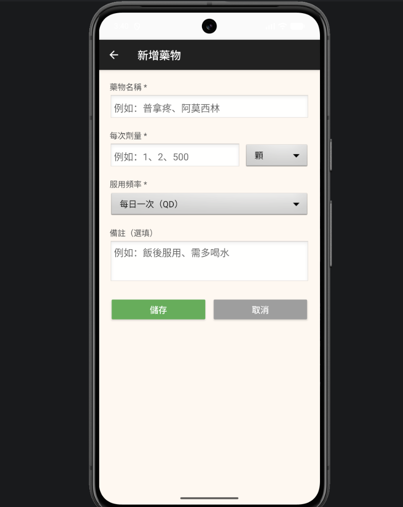
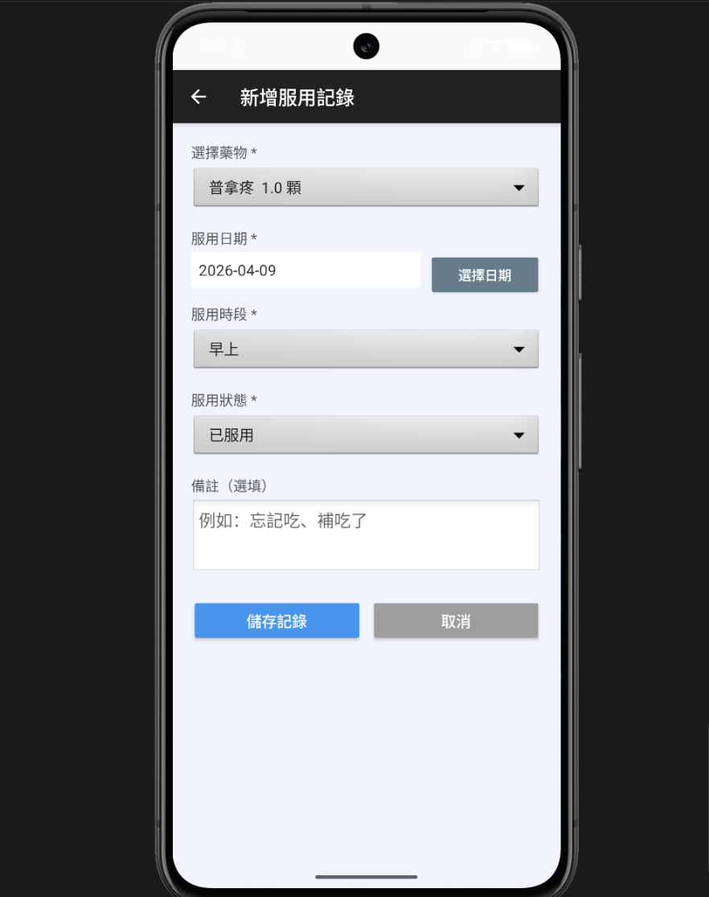
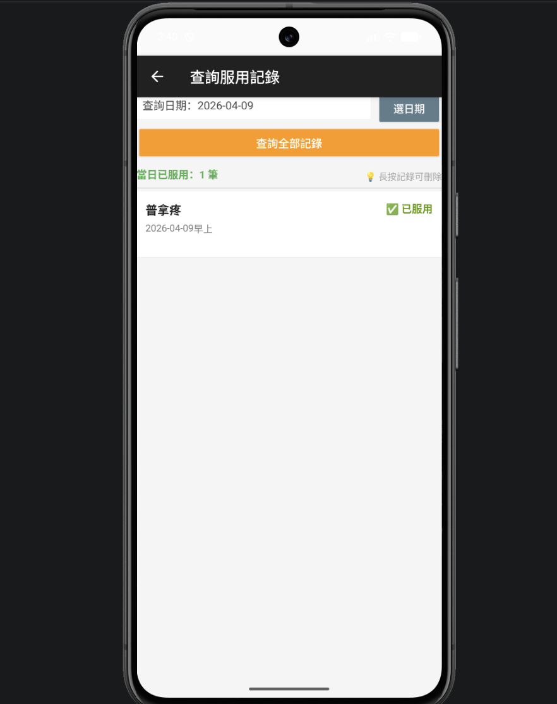

# 藥物服用小幫手 💊

智慧型手機程式設計課程作業，以 Kotlin + SQLite 開發的 Android 藥物管理 App，提供藥物清單管理、服用紀錄新增與依日期查詢功能，與智慧藥盒專題的行動端應用相互呼應。

🎬 **[Demo 影片]([https://drive.google.com/file/d/1o5LswOKnXzaOWebQDRYAxjgphwIlRq1/view?usp=sharing])**

---

## 畫面截圖

### 首頁


### 新增藥物


### 新增服用紀錄


### 查詢服用紀錄


### 刪除藥物


---

## 功能說明

**主要功能**
- 新增藥物：輸入藥物名稱、每次劑量、服用頻率及備注
- 新增服用紀錄：選擇藥物，記錄日期、時段（早上／中午／晚上）與服用狀態
- 查詢服用紀錄：依日期篩選明細，顯示當日已服用筆數統計
- 刪除功能：長按清單項目刪除藥物，連帶刪除相關服用紀錄

---

## 程式架構

| 檔案 | 說明 |
|------|------|
| `MainActivity.kt` | 首頁，顯示藥物清單，提供新增、刪除、導航功能 |
| `AddMedicineActivity.kt` | 新增藥物頁面，表單輸入與資料庫寫入 |
| `AddRecordActivity.kt` | 新增服用紀錄頁面，Spinner 選擇藥物與日期 |
| `QueryActivity.kt` | 查詢紀錄頁面，依日期篩選並統計服藥次數 |
| `DatabaseHelper.kt` | SQLite 資料庫管理，包含藥物與服用紀錄兩張資料表 |

```
app/
└── src/main/java/
    ├── MainActivity.kt
    ├── AddMedicineActivity.kt
    ├── AddRecordActivity.kt
    ├── QueryActivity.kt
    └── DatabaseHelper.kt
```

---

## 資料庫設計

使用 SQLite 管理兩張資料表：

**medicines（藥物清單）**

| 欄位 | 型別 | 說明 |
|------|------|------|
| id | INTEGER PK | 主鍵 |
| name | TEXT | 藥物名稱 |
| dose | TEXT | 每次劑量 |
| unit | TEXT | 劑量單位 |
| frequency | TEXT | 服用頻率 |
| note | TEXT | 備注 |

**records（服用紀錄）**

| 欄位 | 型別 | 說明 |
|------|------|------|
| id | INTEGER PK | 主鍵 |
| medicine_id | INTEGER FK | 關聯藥物 |
| date | TEXT | 服用日期 |
| time_slot | TEXT | 時段（早上／中午／晚上） |
| status | TEXT | 服用狀態（已服用／未服用） |
| note | TEXT | 備注 |

---

## 技術棧

| 技術 | 說明 |
|------|------|
| Kotlin | 主要開發語言 |
| SQLite | 本地資料庫，管理藥物與服用紀錄 |
| Android SQLiteOpenHelper | 資料庫版本管理與操作 |
| ConstraintLayout | UI 版面配置 |
| Spinner | 下拉選單元件 |
| DatePickerDialog | 日期選擇對話框 |

---

## 如何執行

### 環境需求

- Android Studio
- Android SDK 36
- 實體裝置或模擬器（Android 8.0 以上）

### 步驟

1. Clone 專案
2. 用 Android Studio 開啟
3. 等待 Gradle 同步完成
4. 點選 Run 安裝至裝置或模擬器

---

## 學習成果

- 實作 Android 多 Activity 架構與 AndroidManifest.xml 設定
- 使用 SQLiteOpenHelper 設計雙資料表的 CRUD 操作
- 以 SQL COUNT 語法統計當日服藥總次數
- 實作 DatePickerDialog、Spinner 等 UI 元件
- 排查 Android Studio 專案目錄結構（layout 資料夾錯誤）與模擬器空間不足等問題
